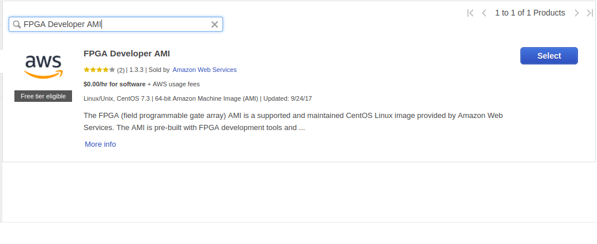

DETI/UFC - Cursos de Eng. de Computação e Eng. de Telecomunicações

Elaborada por Jardel Silveira e Vanessa Rodrigues 

# ** Criação de uma Amazon FPGA Image (AFI) do exemplo CL hello_world**

**Descrição**

Nesta prática vamos conectar e configurar a instância t2.2xlarge do EC2 para a implementação e sintetização de um exemplo disponível no AWS EC2 FPGA Hardware and Software Development Kits. Além disso, vamos conectar e configurar a instância  f1.2xlarge para carregar o projeto sintetizado em uma FPGA e testá-lo. 

O exemplo utilizado será o hello_world, um exemplo simples que demonstra a conectividade básica Shell-para-Cl, instâncias de registradores com mapeamento de memória e o uso dos switches Virtual LED e DIP. Nesse exemplo são implementados dois registradores no Espaço de memória FPGA AppPF BAR0 ([FPGA PCIe memory space overview](https://github.com/aws/aws-fpga/blob/master/hdk/docs/AWS_Fpga_Pcie_Memory_Map.md)) conectado à interface OCL AXI-L. Os registradores são os seguintes:

1. Hello World  (offset 0x500)

2. Virtual LED  (offset 0x504)

O Hello World  é um registrador de leitura/escrita de 32 bits. Para demonstrar o acesso correto a esse registrador, os dados escritos no registrador serão reorganizados (byte swap), tornando os bytes mais significativos como menos significativos e vice-versa. No exemplo, o valor escrito no registrador será 0xefbeadde e o valor lido após o swap será 0xdeadbeef.

O Virtual LED é um registrador de somente leitura de 16 bits, que "sombreia" os 16 bits menos significativos do registrador Hello World, de modo que ele mantenha o mesmo valor dos bits 15: 0 que foram escritos no registrador Hello World sempre que o registrador DIP estiver setado com todos os bits em 1. 

O design do exemplo hello_world utiliza o Virtual LED e um Virtual DIP switch que consistem em dois registradores descritos no arquivo (./../../../common/shell_stable/design/interfaces/cl_ports.vh). 

   input[15:0] sh_cl_status_vdip,               //Virtual DIP. 
   output logic[15:0] cl_sh_status_vled,        //Virtual LEDs 

Neste exemplo, o registrador Virtual LED é usado para direcionar o sinal do LED virtual,  cl_sh_status_vled, e o Virtual DIP switch, sh_cl_status_vdip, é usado para "gatilhar" o valor do registrador Virtual LED enviado ao LED virtual. Por exemplo, se o sh_cl_status_vdip é setado para 16'h00FF, então apenas os 8 bits do registrador Virtual LED serão sinalizados nos sinais do LED virtual cl_sh_status_vled. Porém, se o sh_cl_status_vdip é setado para 16'hFFFF, então os 16 bits do registrador Virtual LED serão sinalizados nos sinais do LED virtual cl_sh_status_vled.

**Objetivos de Aprendizagem**

*  Conexão remota e configuração das instâncias t2.2xlarge e f1.2xlarge.

* Sintetização do projeto hello_world (geração do arquivo .tar) na instância t2.2xlarge.

* Download da AFI, gerada a partir do projeto hello_world, na FPGA da instância f1.2xlarge.

* Execução do teste do projeto hello_world.

**Parte 1 - Criar e Registrar uma Amazon FPGA Image (AFI)**

1. Criar e conectar uma instância t2.2xlarge com o Ambiente de desenvolvimento **FPGA Developer AMI.**

    1. Para isso, acesse [https://console.aws.amazon.com](https://console.aws.amazon.com) **. ** Você deve estar logado em sua conta Amazon**.**

    2. No canto superior direito, escolha a região **Us East (N. Vírginia)**.

    3. Clique em **EC2**

    4. No menu do canto esquerdo, clique em **instances**

    5. Na tela de Instâncias, clique em **Launch Instance**

    6. No primeiro passo, você deve escolher o AMI da instância. Clique em **Aws Marketplace**

    7. Na barra de procura, digite **FPGA Developer AMI **e clique em **select **e depois clique em **continue **

    8. Em C**hoose Instance Type**, escolha** t2.2xlarge**

    9. Na aba **Configure Security Group**, clique em **Select an existing security group** e escolha aquele criado na pré-prática parte 3 item 4   

    10. Finalmente, clique em **Review and Launch **e depois clique em **Launch**

OBS: Ignore a seguinte mensagem informada: "Your instance configuration is not eligible for the free usage tier To launch an instance that's eligible for the free usage tier, check your AMI selection, instance type, configuration options, or storage devices. Learn more about free usage tier eligibility and usage restrictions". Ela aparece porque a AMI selecionada não faz parte da camada gratuita da AWS.

** **

    11. Em **Choose an Existing Key Pair**, escolha aquela criada na pré-prática parte 3 item 5, selecione o checkbox para aceitar as permissões e clique em **Launch Instances** .

    12. Para verificar o estado da instância clique em** View Instances** .

    13. Verifique se a instância passou suas verificações de status, ou seja, a informação do status é **2/2 checks pass**. Você pode visualizar essas informações na coluna Status Checks na página Instances.

    14. Para conectar a instância, no caso de usuários linux, selecione a instância e clique em conectar, siga os passos informando na janela que será aberta. Obs: No comando informado, substitua "root" por “centos”.

    15. Para conectar a instância, no caso de usuários do Windows, deve-se seguir esse tutorial [http://docs.aws.amazon.com/AWSEC2/latest/UserGuide/putty.html](http://docs.aws.amazon.com/AWSEC2/latest/UserGuide/putty.html).

1. Configure o HDK e configure o CLI AWS

git clone https://github.com/aws/aws-fpga.git $AWS_FPGA_REPO_DIR
cd $AWS_FPGA_REPO_DIR
source hdk_setup.sh

Obs: Ao usar o developer AMI a variável AWS_FPGA_REPO_DIR corresponde ao diretório /home/centos/src/project_data/aws-fpga.

Configure o AWS CLI inserindo as mesmas informações usadas na Prática  [Criação de uma conta na AWS Educate e Solicitação da Instância EC2 F1 versão 2](https://docs.google.com/document/d/1KqZaynTWjV411tO_3G1j1Y5GVyugGKZN3dh5g0K94bQ/edit).

OBS: suas credenciais podem ser encontradas na página [https://console.aws.amazon.com/iam/home?#/security_credential](https://console.aws.amazon.com/iam/home?#/security_credential) 

2. Mudando para o diretório do exemplo **cl_hello_world** 

	cd $HDK_DIR/cl/examples/cl_hello_world    

export CL_DIR=$(pwd)

3. Construindo a Custom Logic (CL)

A geração de DCP pode demorar até várias horas para completar, porém é possível ser notificado via-email quando a compilação for concluída. Para isso, é necessário configurar notificação via SN:

    	$ export EMAIL=your.email@example.com
   	 $ $HDK_COMMON_DIR/scripts/notify_via_sns.py

Após isso, é necessário verificar o endereço de e-mail e confirmar a assinatura. Ao executar o script  **aws_build_dcp_from_cl.sh** adicione a opção **-notify**, uma vez que a compilação esteja completa, um e-mail será enviado notificando que a compilação foi concluída, ou seja, o DCP foi gerado.

O formato do arquivo gerado será YY_MM_DD-hhmm.Developer_CL.tar e após ser gerado estará disponível no diretório  $CL_DIR/build/checkpoints/to_aws/. Caso a configuração notificação via SN não tenha sido realizada, é necessário ficar verificando neste diretório se o arquivo já está disponível.

Para gerar o DCP use os seguintes comandos:

$ vivado -mode batch  # Verificar se o vivado está instalado    

 	$ cd $CL_DIR/build/scripts
	$ ./aws_build_dcp_from_cl.sh   #Executar o script para converter o CL         design para DCP. 

4. Submetendo o Design Checkpoint para a AWS criar a AFI

Após o arquivo .tar ser gerado, é necessário que seja criado um bucket no S3 e seja feito o upload do arquivo tarball no bucket. 

Para fazer o upload do arquivo tarball para S3, podem ser usadas qualquer uma das [ferramentas suportadas pelo S3.](https://docs.aws.amazon.com/AmazonS3/latest/dev/UploadingObjects.html) Por exemplo, você pode usar a CLI AWS da seguinte maneira:

touch 

$ aws s3 mb s3://<bucket-name> --region <region>   # Criar um S3 bucket (Escolha um nome único para o bucket)
$ aws s3 mb s3://<bucket-name>/<dcp-folder-name>/   # Criar uma pasta para seu arquivo tarball 
$ aws s3 cp $CL_DIR/build/checkpoints/to_aws/<YY_MM_DD-hhmm>.Developer_CL.tar s3://<bucket-name>/<dcp-folder-name>/       # Fazer o upload do arquivo para o S3
        

$ aws s3 mb s3://<bucket-name>/<logs-folder-name>/  # Criar uma pasta para guardar seu arquivo de log
$ touch LOGS_FILES_GO_HERE.txt                     # Criar um arquivo temporário (temp file)
$ aws s3 cp LOGS_FILES_GO_HERE.txt s3://<bucket-name>/<logs-folder-name>/ #Copiar o arquivo de log para a pasta criada
   

Para criar a AFI use o seguinte comando:

aws ec2 create-fpga-image \
        --region <region> \
        --name <afi-name> \
        --description <afi-description> \
        --input-storage-location Bucket=<dcp-bucket-name>,Key=<path-to-tarball> \
        --logs-storage-location Bucket=<logs-bucket-name>,Key=<path-to-logs> \
	[ --client-token <value> ] \
	[ --dry-run | --no-dry-run ]

Exemplo:

aws ec2 create-fpga-image --region us-east-1 --name hello_world_testee --description testee --input-storage-location Bucket=testeBcp,Key=tcc/18_01_21-144505.Developer_CL.tar --logs-storage-location Bucket=logsteste,Key=LOG/LOGS_FILES_GO_HERE.txt --client-token mytokenn

A saída desse comando é composta dois identificadores referentes a AFI criada:

* FPGA Image Identifier ou AFI ID: este é o ID principal, usado para gerenciar a AFI através dos comandos AWS EC2 CLI e AWS SDK APIs. Este ID é regional, ou seja, se um AFI é copiado em várias regiões, ele terá uma ID AFI única diferente em cada região. Um exemplo de AFI ID é afi-06d0ffc989feeea2a.

* Global FPGA Image Identifier ou AGFI ID: esta é uma identificação global que é usada para se referir a um AFI dentro de uma instância F1. Por exemplo, para carregar ou limpar um AFI de um slot FPGA, você usa o AGFI ID. Uma vez que as IDs AGFI são globais (por design), permite copiar uma combinação de AFI / AMI para várias regiões, e elas funcionarão sem requerer nenhuma configuração adicional. Um exemplo AGFI ID é agfi-0f0e045f919413242.

O comando  de descrição-fpga-images permite verificar o estado da AFI durante o processo de geração. É preciso fornecer o FPGA Image Identifier retornado, como por exemplo:

  

 $ aws ec2 describe-fpga-images --fpga-image-ids afi-016fd6ccf3c73bf28

A AFI só pode ser carregada em uma instância F1 após a conclusão da sua geração e o estado AFI está configurado para disponível, como no seguinte exemplo:

   {
        "FpgaImages": [
            {
			    ...
                "State": {
                    "Code": "available"
                },
			    ...
                "FpgaImageId": "afi-06d0ffc989feeea2a",
			    ...
            }
        ]
    }

Após a conclusão da geração da AFI, a AWS colocará os logs na localização do bucket (s3: // <nome do bucket> / <logs-pasta-name>) fornecido pelo desenvolvedor. A presença desses logs é uma indicação de que o processo de criação está completo.

Exemplo de uma AFI Gerada pelo exemplo cl_hello_world

{

	"FpgaImageId": "afi-05d9e2884c627cbc2",

	"FpgaImageGlobalId": "agfi-09ed851c9ba0e59f0"

}

**Parte 2 - Carregar e testar uma AFI registrada em uma instância F1**

Para realizar os próximos passos, será necessário iniciar uma instância F1. Para isso, é necessário fazer semelhante como na Parte 1 - Criar e Registrar uma Amazon FPGA Image (AFI) e no item h escolher f1.2xlarge.

5. Configuração de ferramentas de gerenciamento AWS FPGA

As ferramentas de gerenciamento FPGA são necessárias para carregar uma AFI em um FPGA.

    git clone https://github.com/aws/aws-fpga.git $AWS_FPGA_REPO_DIR
    cd $AWS_FPGA_REPO_DIR
    source sdk_setup.sh

Configure as credenciais do AWS Cli como no item 2 da parte 1.

   $ aws configure         # Setar suas credenciais 

OBS: suas credenciais podem ser encontradas na página [https://console.aws.amazon.com/iam/home?#/security_credential](https://console.aws.amazon.com/iam/home?#/security_credential) 

6. Carregar a AFI

Para certificar que qualquer AFI que tenha sido carregada anteriormente no slot esteja limpa, é necessário usar o seguinte comando:

$ sudo fpga-clear-local-image  -S 0

Para verificar se o espaço está limpo, é necessário usar o comando:

  $ sudo fpga-describe-local-image -S 0 -H

Se o espaço estiver limpo, a saída do comando será a seguinte:

Se a descrição retorna um status 'Ocupado', o FPGA ainda está executando a operação anterior em segundo plano. É necessário aguardar até que o status seja 'cleared' como acima.

Para carregar a AFI na FPGA é necessário usar o comando abaixo, informando o AGFI ID da AFI criada, como no exemplo:

 $ sudo fpga-load-local-image -S 0 -I agfi-09ed851c9ba0e59f0

Após isso é necessário  verificar se o AFI foi carregado corretamente. A saída mostra o FPGA no estado "loaded" após a operação "load" da imagem FPGA, como abaixo:

   $ sudo fpga-describe-local-image -S 0 -R -H

  

7. Validando usando o Software de Exemplo CL

	Cada CL exemplo vem com um software de tempo de execução sob $ CL_DIR / software / runtime / subdiretório. é necessário construir o aplicativo de tempo de execução que corresponda ao AFI carregado, da seguinte forma:

cd $HDK_DIR/cl/examples/cl_hello_world    

export CL_DIR=$(pwd)

cd $CL_DIR/software/runtime/
make all
sudo ./test_hello_world

A saída será a seguinte:

# **(****IMPORTANTE****) Pós-prática: Deletando a instância e os volumes provisionados**

Após a conclusão da prática, é necessário que as instâncias que estão executando e os volumes, provisionados para essas instâncias, sejam deletados.

1. Selecione **Instances **no menu lateral esquerdo.

2. Selecione a Instância que está sendo executada, clique **Actions**, escolha **Instance State** e em seguida, clique em **Terminate**.

3. Selecione **Elastic Block Store **no menu lateral esquerdo e clique em **Volumes**.

4. Selecione os volumes listados na tela, clique em **Actions**, e em seguida, clique em **Delete Volumes**.

**Referências**

* Amazon Web Services. Hardware Development Kit (HDK) e Software Development Kit (SDK) [internet]. [Acesso em: 26 dez. 2017]. Disponível em: https://github.com/aws/aws-fpga/tree/master/hdk/cl/examples

* Amazon Web Services. Instâncias F1 do Amazon EC2 [internet]. [Acesso em: 26 dez. 2017]. Disponível em: [https://aws.amazon.com/pt/ec2/instance-types/f1/](https://aws.amazon.com/pt/ec2/instance-types/f1/)

* Amazon Web Services. Documentação do Amazon Elastic Compute Cloud [internet]. [Acesso em: 26 dez. 2017]. Disponível em: https://aws.amazon.com/pt/documentation/ec2/

