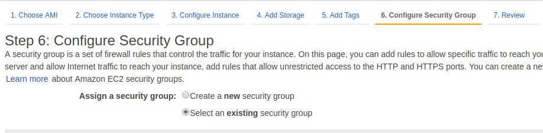
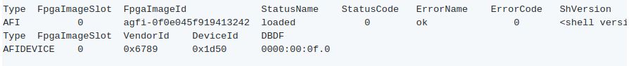
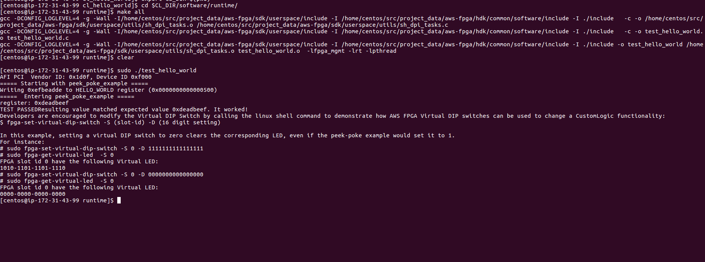

DETI/UFC - Cursos de Eng. de Computação e Eng. de Telecomunicações

Elaborada por Jardel Silveira e Vanessa Rodrigues 

# **Criação de uma Amazon FPGA Image (AFI) do exemplo CL hello_world**

**Descrição**

Nesta prática vamos conectar e configurar a instância t2.2xlarge do EC2 para a implementação e sintetização de um exemplo disponível no AWS EC2 FPGA Hardware and Software Development Kits. Além disso, vamos conectar e configurar a instância  f1.2xlarge

para carregar o projeto sintetizado e testá-lo. 

O exemplo utilizado será o cl_hello_world, um exemplo simples que demonstra a conectividade básica Shell-para-Cl, instâncias de registradores com mapeamento de memória e o uso dos switches Virtual LED e DIP. Nesse exemplo são implementados dois registradores no Espaço de memória FPGA AppPF BAR0 ([FPGA PCIe memory space overview](https://github.com/aws/aws-fpga/blob/master/hdk/docs/AWS_Fpga_Pcie_Memory_Map.md)) conectado à interface OCL AXI-L. Os registradores são os seguintes:

1. Hello World  (offset 0x500)

2. Virtual LED  (offset 0x504)

O Hello World  é um registrador de leitura/escrita de 32 bits. Para demonstrar o acesso correto a esse registrador, os dados escritos no registrador serão reorganizados (byte swapp), tornando os bits mais significativos como menos significativos e vice-versa. No exemplo, o valor escrito no registrador será 0xefbeadde e o valor lido após o swapp será 0xdeadbeef.

O Virtual LED é um registrador de somente leitura de 16 bits, que "sombreia" os 16 bits menos significativos do registrador Hello World, de modo que ele mantenha o mesmo valor dos bits 15: 0 que foram escritos no registrador Hello World. 

O design do exemplo hello_world utiliza o Virtual LED e um DIP switch que consistem em dois sinais descritos no arquivo (./../../../common/shell_stable/design/interfaces/cl_ports.vh). 

   input[15:0] sh_cl_status_vdip,               //Virtual DIP. 
   output logic[15:0] cl_sh_status_vled,        //Virtual LEDs 

Neste exemplo, o registrador Virtual LED é usado para direcionar o sinal do LED virtual,  cl_sh_status_vled, e o Virtual DIP switch, sh_cl_status_vdip, é usado para "gatilhar" o valor do registrador Virtual LED enviado ao LED virtual. Por exemplo, se o sh_cl_status_vdip é setado para 16'h00FF, então apenas os 8 bits do registrador Virtual LED serão sinalizados no sinal do LED virtual cl_sh_status_vled. Porém, se o sh_cl_status_vdip é setado para 16'hFFFF, então os 16 bits do registrador Virtual LED serão sinalizados no sinal do LED virtual cl_sh_status_vled.

**Objetivos de Aprendizagem**

*  Conexão e configuração das instâncias t2.2xlarge e f1.2xlarge.

* Sintetização do projeto hello_world (geração do arquivo .tar).

* Download da AFI, gerada a partir do projeto hello_world, na FPGA da instância f1.2xlarge.

* Execução do teste do projeto hello_world.

**Parte 1 - Configurar a AWS CLI e o Amazon EC2**


1. Faremos uso da AWS CLI, que é uma ferramenta de código aberto criada com base no AWS SDK for Python (Boto) que fornece comandos para interagir com os serviços da AWS. 

2. A AWS CLI já foi instalada previamente nos PCs do laboratório, mas para começar a usá-la é necessário fazer a configuração. Para uso geral, o comando aws configure é a maneira mais rápida de configurar a AWS CLI.	

A AWS CLI solicitará algumas informações de segurança, dentre elas o ID da chave de acesso da AWS e a chave de acesso secreta da AWS, que são  credenciais da sua conta. Para criá-las acesse a página [https://console.aws.amazon.com/iam/home#/home](https://console.aws.amazon.com/iam/home#/home), clique em Users e crie um novo usuário com permissões de Admin. Obtenha as informações de Acess Key ID e secret Acess Key. 

No terminal digite ``` aws configure ``` e insira as informações obtidas (O ID da chave de acesso da AWS e a chave de acesso secreta). Para a região insira ``` us-east-1``` e para o formato de saída defina ```json```.

3. A próxima etapa é configurar os pré-requisitos para a execução de uma instância do EC2 que podem ser acessados usando o SSH. Para fazer todas as configurações recomendadas pela AWS é necessário seguir o tutorial descrito no link [https://docs.aws.amazon.com/AWSEC2/latest/UserGuide/get-set-up-for-amazon-ec2.html](https://docs.aws.amazon.com/AWSEC2/latest/UserGuide/get-set-up-for-amazon-ec2.html) . Porém, para esta prática será necessário apenas criar um security group e uma key-pair. O  procedimento será descrito nos ítens a seguir.

4. Primeiro, crie um novo security group e em seguida, adicione uma regra que permite o tráfego de entrada na porta 22 para o SSH. Guarde o ID do security group para uso posterior.

```bash 
$ aws ec2 create-security-group --group-name nomeDoSecurityGroup-sg --description "Descricao do security group"
```

```bash 
$ aws ec2 authorize-security-group-ingress --group-name nomeDoSecurityGroup-sg --protocol tcp --port 22 --cidr  0.0.0.0/0
```


5. Em seguida, crie uma key pair, atribuindo um nome da sua escolha. Essa key pair permite que você se conecte à instância.
Use o comando abaixo:

```bash 
$ aws ec2 create-key-pair --key-name nomeDaKeyPair-key --query 'KeyMaterial' --output text > nomeDaKeyPair-key.pem
```

		
 Esse comando iniciará um download de um arquivo .pem, que deverá ser guardado em um diretório de fácil acesso. 
 
6. No Linux, é necessário alterar o modo de arquivo, de forma que somente você tenha acesso ao arquivo de chave.

```bash 
$ chmod 400 devenv-key.pem
```
	

**Parte 2 - Iniciar e conectar à instância**

1. Criar e conectar uma instância t2.2xlarge com o Ambiente de desenvolvimento **FPGA Developer AMI.**

    1. Execute o comando a seguir, substituindo o ID do security group e o nome da key pair, obtidos na parte 1. 
```bash
 $ aws ec2 run-instances --image-id ami-626e9918 --security-group-ids sg-6fc17419 --count 1 --instance-type t2.2xlarge --key-name nomeDaKeyPair --query 'Instances[0].InstanceId'
```
Esse comando retornará o ID da instância, que deverá ser guardado para uso posterior.

2. A inicialização da instância pode levar alguns instantes. Assim que a instância estiver em execução, o endereço de IP público que será usado para se conectar à instância será recuperado com o comando a seguir. Substitua o ID da instância pelo obtido na etapa anterior.
```bash
aws ec2 describe-instances --instance-ids "i-0787e4282810ef9cf" --query 'Reservations[0].Instances[0].PublicIpAddress'
```


3. Para se conectar à instância, use o endereço de IP público e chave privada. Para isso, entre no diretório em que a key pair foi guardada e utilize o seguinte comando, substituindo o IP público pelo obtido na etapa anterior:
```bash
ssh -i nomeDaKeyPair.pem centos@54.183.22.255
```

Substitua o ID do IP público pelo obtido na etapa anterior.

**Parte 3 - Criar e Registrar uma Amazon FPGA Image (AFI)**

1. Configure o HDK e configure o CLI AWS

```bash 
$ git clone https://github.com/aws/aws-fpga.git $AWS_FPGA_REPO_DIR
$ cd $AWS_FPGA_REPO_DIR
$ source hdk_setup.sh
```

Obs: Ao usar o developer AMI a variável AWS_FPGA_REPO_DIR corresponde ao diretório /home/centos/src/project_data/aws-fpga.

Configure o AWS CLI inserindo as mesmas informações usadas na parte 1.

OBS: suas credenciais podem ser encontradas na página [https://console.aws.amazon.com/iam/home?#/security_credential](https://console.aws.amazon.com/iam/home?#/security_credential) 

2. Mudando para o diretório do exemplo **cl_hello_world** 

```bash
$ cd $HDK_DIR/cl/examples/cl_hello_world
$ export CL_DIR=$(pwd)
```

3. Construindo a Custom Logic (CL)

Nesta etapa será gerado um DCP, que é um arquivo .tar, para criar a Custom Logic. A geração do DCP pode demorar até várias horas para completar, porém é possível ser notificado via-email quando a compilação for concluída. Para isso, é necessário configurar notificação via SN:

```bash
$ export EMAIL=your.email@example.com
$ $HDK_COMMON_DIR/scripts/notify_via_sns.py
```

Após isso, é necessário verificar o endereço de e-mail e confirmar a assinatura. Uma vez que a compilação esteja completa, um e-mail será enviado notificando que a compilação foi concluída, ou seja, o DCP foi gerado.

O formato do arquivo gerado será YY_MM_DD-hhmm.Developer_CL.tar e após ser gerado estará disponível no diretório  $CL_DIR/build/checkpoints/to_aws/. Caso a configuração notificação via SN não tenha sido realizada, é necessário ficar verificando neste diretório se o arquivo já está disponível.

Para gerar o DCP use os seguintes comandos:

$ vivado -mode batch  # Verificar se o vivado está instalado    

```bash
$ cd $CL_DIR/build/scripts
$ ./aws_build_dcp_from_cl.sh -notify  #Executar o script para converter o CL design para DCP. 
```
	
4. Submetendo o Design Checkpoint para a AWS criar a AFI

Após o arquivo .tar ser gerado, é necessário que seja criado um bucket no S3 e seja feito o upload do arquivo tarball no bucket. 

Para fazer o upload do arquivo tarball para S3, podem ser usadas qualquer uma das [ferramentas suportadas pelo S3.](https://docs.aws.amazon.com/AmazonS3/latest/dev/UploadingObjects.html) Por exemplo, você pode usar a CLI AWS da seguinte maneira:

```bash
$ aws s3 mb s3://<bucket-name> --region <region>   # Criar um  bucket no S3 (Escolha um nome único para o bucket)
$ aws s3 mb s3://<bucket-name>/<dcp-folder-name>/   # Criar uma pasta para seu arquivo tarball 

$ aws s3 cp $CL_DIR/build/checkpoints/to_aws/*.Developer_CL.tar \ s3://<bucket-name>/<dcp-folder-name>/ # Fazer o upload do arquivo para o S3        

$ aws s3 mb s3://<bucket-name>/<logs-folder-name>/  # Criar uma pasta para guardar seu arquivo de log
$ touch LOGS_FILES_GO_HERE.txt                     # Criar um arquivo temporário (temp file)
$ aws s3 cp LOGS_FILES_GO_HERE.txt s3://<bucket-name>/<logs-folder-name>/ #Copiar o arquivo de log para a pasta criada
```
   

Para criar a AFI use o seguinte comando:

```bash
$ aws ec2 create-fpga-image \
        --region <region> \
        --name <afi-name> \
        --description <afi-description> \
        --input-storage-location Bucket=<dcp-bucket-name>,Key=<path-to-tarball> \
        --logs-storage-location Bucket=<logs-bucket-name>,Key=<path-to-logs> \
	[ --client-token <value> ] 
```


A saída desse comando é composta dois identificadores referentes a AFI criada:

* FPGA Image Identifier ou AFI ID: este é o ID principal, usado para gerenciar a AFI através dos comandos AWS EC2 CLI e AWS SDK APIs. Este ID é regional, ou seja, se um AFI é copiado em várias regiões, ele terá uma ID AFI única diferente em cada região. Um exemplo de AFI ID é afi-06d0ffc989feeea2a.

* Global FPGA Image Identifier ou AGFI ID: esta é uma identificação global que é usada para se referir a um AFI dentro de uma instância F1. Por exemplo, para carregar ou limpar um AFI de um slot FPGA, você usa o AGFI ID. Uma vez que as IDs AGFI são globais (por design), permite copiar uma combinação de AFI / AMI para várias regiões, e elas funcionarão sem requerer nenhuma configuração adicional. Um exemplo AGFI ID é agfi-0f0e045f919413242.

O comando  de descrição-fpga-images permite verificar o estado da AFI durante o processo de geração. É preciso fornecer o FPGA Image Identifier retornado, substitua no comando abaixo:

```bash
$ aws ec2 describe-fpga-images --fpga-image-ids afi-016fd6ccf3c73bf28
```

A AFI só pode ser carregada em uma instância F1 após a conclusão da sua geração e o estado AFI está configurado para disponível, como no seguinte exemplo:
```
{
        "FpgaImages": {
            {
			   
                "State": {
                    "Code": "available"
                },
			    ...
                "FpgaImageId": "afi-06d0ffc989feeea2a",
			    ...
            }
        ]
    }
```
Após a conclusão da geração da AFI, a AWS colocará os logs na localização do bucket (s3: // <nome do bucket> / <logs-pasta-name>) fornecido pelo desenvolvedor. A presença desses logs é uma indicação de que o processo de criação está completo.


**Parte 3 - Carregar e testar uma AFI registrada em uma instância F1**

Para realizar os próximos passos, será necessário iniciar uma instância F1. Para isso, siga os procedimentos da  Parte 2 e  substitua o parâmetro do tipo de instância para ```--instance-type f1.2xlarge```.

5. Configuração de ferramentas de gerenciamento AWS FPGA

Faça o download das ferramentas de gerenciamento FPGA, que são necessárias para carregar uma AFI em um FPGA, e configure o ambiente. Utilize os comandos abaixo:

```bash
$ git clone https://github.com/aws/aws-fpga.git $AWS_FPGA_REPO_DIR
$ cd $AWS_FPGA_REPO_DIR
$ source sdk_setup.sh
```
 	

Configure as credenciais do AWS Cli como no item 2 da parte 1.
```bash
$ aws configure         # Setar suas credenciais 
```

OBS: suas credenciais podem ser encontradas na página [https://console.aws.amazon.com/iam/home?#/security_credential](https://console.aws.amazon.com/iam/home?#/security_credential).

 

6. Carregar a AFI

Para certificar que qualquer AFI que tenha sido carregada anteriormente no slot esteja limpa, é necessário usar o seguinte comando:

```bash
$ sudo fpga-clear-local-image  -S 0
```

Para verificar se o espaço está limpo, é necessário usar o comando:

 ```bash
  $ sudo fpga-describe-local-image -S 0 -H
 ```

Se o espaço estiver limpo, a saída do comando será a seguinte:


Se a descrição retorna um status 'Ocupado', a FPGA ainda está executando a operação anterior em segundo plano. É necessário aguardar até que o status seja 'cleared' como acima.

Para carregar a AFI na FPGA é necessário usar o comando abaixo, substituindo o AGFI ID da AFI criada.
```bash 
 $ sudo fpga-load-local-image -S 0 -I agfi-09ed851c9ba0e59f0
```

Após isso é necessário  verificar se o AFI foi carregado corretamente. A saída mostra o FPGA no estado "loaded" após a operação "load" da imagem FPGA, como abaixo:

```bash
   $ sudo fpga-describe-local-image -S 0 -R -H
```

  

7. Validando usando o Software de Exemplo CL

	Cada CL exemplo vem com um software de tempo de execução sob $ CL_DIR / software / runtime / subdiretório. é necessário "construir" o aplicativo de tempo de execução que corresponda ao AFI carregado, da seguinte forma:

```bash
$ cd $HDK_DIR/cl/examples/cl_hello_world    
$ export CL_DIR=$(pwd)
$ cd $CL_DIR/software/runtime/
$ make all
$ sudo ./test_hello_world
```

A saída será a seguinte:



**Parte 4: Fechando a Sessão**

Depois de terminar sua sessão, você pode "Parar" ou "Terminar" sua instância. Se você 'Terminar' a instância, seu volume raiz será excluído. Você precisará criar e configurar uma nova instância na próxima vez que precisar trabalhar na F1. Se você parar a instância, o volume do root é preservado e a instância interrompida pode ser reiniciada mais tarde, não precisando mais passar por etapas de configuração. A AWS não cobra por instâncias interrompidas, mas pode cobrar por qualquer volume EBS anexado à instância.

* Feche a sessão remota 
```bash
$ exit
```

* Retorne para o EC2 Dashboard: [https://console.aws.amazon.com/ec2](https://console.aws.amazon.com/ec2)

* Selecione **Instances** no menu lateral esquerdo.

* Selecione a Instância que está sendo executada, clique **Actions**, escolha **Instance State** e em seguida, clique em **Terminate**.

* Selecione **Elastic Block Store** no menu lateral esquerdo e clique em **Volumes**.

* Selecione os volumes listados na tela, clique em **Actions**, e em seguida, clique em **Delete Volumes**.

	

	

**Referências**

* Amazon Web Services. Hardware Development Kit (HDK) e Software Development Kit (SDK) [internet]. [Acesso em: 26 dez. 2017]. Disponível em: https://github.com/aws/aws-fpga/tree/master/hdk/cl/examples

* Amazon Web Services. Instâncias F1 do Amazon EC2 [internet]. [Acesso em: 26 dez. 2017]. Disponível em: [https://aws.amazon.com/pt/ec2/instance-types/f1/](https://aws.amazon.com/pt/ec2/instance-types/f1/)

* Amazon Web Services. Documentação do Amazon Elastic Compute Cloud [internet]. [Acesso em: 26 dez. 2017]. Disponível em: https://aws.amazon.com/pt/documentation/ec2/

