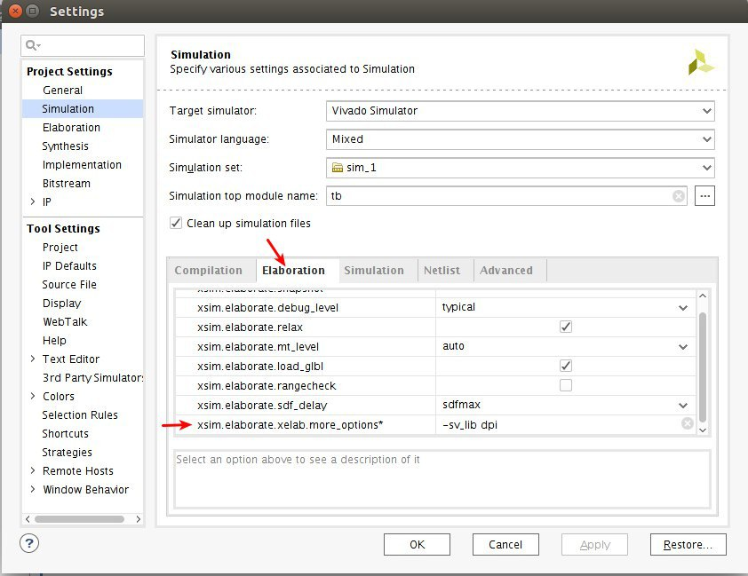
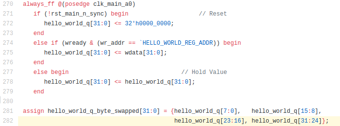

DETI/UFC - Cursos de Eng. de Computação e Eng. de Telecomunicações

Elaborada por Jardel Silveira e Vanessa Rodrigues 

# ** Implementando um somador a partir do exempo Hello_world**

**Descrição**

No exemplo hello_world tem-se um software onde estão definidos os endereços dos registradores Hello world e Virtual LED e onde são utilizadas as funções de escrita (fpga_pci_poke) e leitura (fpga_pci_peek) desses registradores. Além disso, do lado do hardware tem-se o design, onde também estão definidos os endereços dos registradores, e onde são implementados processos  de leitura e escrita dos registradores de acordo com a lógica proposta pelo exemplo hello_world. Por exemplo, o software escreve um valor no registrador Hello world, por meio da função fpga_pci_poke, o processo implementado no design ler o dado no registrador, realiza o Swapped, escreve o novo valor e então o software ler o novo valor do registrador por meio da função fpga_pci_peek.

Nesta prática vamos implementar uma soma de dois valores, a partir do exemplo hello_world. Serão instanciados dois registradores com os valores a serem somados e um registrador com o resultado da soma, além da lógica no lado do software e do hardware.

**Objetivos de Aprendizagem**

* Instanciamento de registradores.

* Implementação  do somador no design.

* Implementação do somador no software.

**Parte 1:**

1. Faça um `Fork` do repositório [https://github.com/aws/aws-fpga.git](https://github.com/aws/aws-fpga.git) para um repositório da sua conta do Github. Após isso, faça um `clone` desse repositório no seu computador local.

OBS: Caso seja preciso configurar o git na sua máquina,  utilize os comandos abaixo para a configuração inicial.
```bash 
$ git config --global user.name "John Doe"
$ git config --global user.email johndoe@example.com
```
   Após isso, gere a chave pública SSH, utilizando o procedimento descrito na [documentação](https://git-scm.com/book/pt-br/v1/Git-no-Servidor-Gerando-Sua-Chave-P%C3%BAblica-SSH) do git, em seguida adicione a chave gerada na tela de SSH Keys da interface do github.

2. Para definir os endereços dos registradores no lado do hardware:
  
   i. Abra o arquivo ```hdk/cl/examples/common/design/cl_common_defines.vh```
	
   ii. Neste arquivo estão definidos os endereços dos registradores utilizados no exemplo hello_world da seguinte maneira:
	```bash 
	`define HELLO_WORLD_REG_ADDR           32'h0000_0500
	`define VLED_REG_ADDR                  32'h0000_0504
	```
     iii. Adicione os três registradores necessários para a implementação do somador, nos endereços seguintes.
     ```bash 
	 `define X_REG_ADDR              32'h0000_0508
     `define Y_REG_ADDR              32'h0000_050C
     `define Z_REG_ADDR              32'h0000_0510
	```
     
3. Feito isso, teremos que modificar o arquivo de implementação do design. Abra o arquivo ```hdk/cl/examples/cl_hello_world/design/cl_hello_world.sv``` 

	1. Perceba que a partir da linha 49 estão definidos os wires. Adicione os wires necessários, com tamanhos de 32 bits.

	A partir da linha 243 até a linha 263 está implementado o processo de resposta de leitura. Perceba que quando a leitura realizada é do registrador ``HELLO_WORLD_REG_ADD``, o valor a ser escrito será ``hello_world_q_byte_swapped[31:0]``.

	

	O ``hello_world_q_byte_swapped[31:0]`` está definido no processo logo abaixo, a partir da linha 270 até a linha 282. 

	


	  Esse processo define que no sinal do reset o wire ``hello_world_q`` receberá o valor de ``32’h0000_0000`` (será zerado), quando houver o sinal de leitura e os dados forem do registrador ``HELLO_WORLD_REG_ADDR``, então o wire ``hello_world_q`` receberá a informação contida  no registrador. Caso não ocorra nenhuma dessas duas situações , o wire ``hello_world_q`` apenas manterá seu valor anterior.  E finalmente, o valor atibuído ao wire ``hello_world_q_byte_swapped`` será o dado reorganizado, de forma que os bits menos significativos passam a ser mais significativos e vice-versa.

 
 	2. A partir dessa implementação, insira (a partir da linha 283) o trecho de código que define o processo da soma de dois valores de entrada.

4. Feita as modificações no design, precisamos agora modificar o software para realizarmos a escrita dos valores que serão somados e a leitura do resultado.

    1. Abra o arquivo ``hdk/cl/examples/cl_hello_world/software/runtime/test_hello_world.c``

    2. Primeiro, é preciso declarar os registradores e seus endereços, utilizando os mesmos nomes dos que foram declarados no arquivo ``cl_common_defines.vh``.  Nas linhas 40 e 41 adicione a declaração dos registradores.
	

    3. Perceba que entre as linhas 236 e 256 a escrita e a leitura do registrador  ```HELLO_WORLD_REG_ADDR```  foram   implementadas, usando as funções ``fpga_pci_poke`` e ``fpga_pci_peek``. Com base nesse código, vamos utilizar a função ``fpga_pci_poke`` para escrever os dois valores de entrada nos registrados definidos para armazenar os dados de entrada, ``X_REG_ADDR UINT64_C(0x508)`` e ``Y_REG_ADDR UINT64_C(0x50C)``, e a função ``fpga_pci_peek`` para ler o resultado da soma que estará armazenada no registrador definido para armazenar o dado de saída ``Z_REG_ADDR UINT64_C(0x510)``. Para isso, abaixo da função descrita acima (linha 257), adicione o seguinte código:

```bash
  //adder

    /* write a value into the mapped address space */

    uint32_t x,y;

    x=2;

    y=3;

    expected = x+y;

    printf("Writing 0x%08x to X register (0x%016lx)\n", x, X_REG_ADDR);

    rc = fpga_pci_poke(pci_bar_handle, X_REG_ADDR, x);

    fail_on(rc, out, "Unable to write to the fpga !");

    printf("Writing 0x%08x to Y register (0x%016lx)\n", y, Y_REG_ADDR);

    rc = fpga_pci_poke(pci_bar_handle, Y_REG_ADDR, y);

    fail_on(rc, out, "Unable to write to the fpga !");

    /* read it back and print it out; you should expect the byte order to be

     * reversed (That's what this CL does) */

    rc = fpga_pci_peek(pci_bar_handle, Z_REG_ADDR, &value);

    fail_on(rc, out, "Unable to read read from the fpga !");

    printf("=====  Entering peek_poke_example =====\n");

    printf("register: 0x%x\n", value);

    printf("=====  Entering peek_poke_example =====\n");

    printf("registers x and y: 0x%x\n 0x%x\n", x,y);

    if(value == expected) {

        printf("TEST PASSED");

        printf("Resulting value matched expected value 0x%x. It worked!\n", expected);

    }

    else{

        printf("TEST FAILED");

        printf("Resulting value did not match expected value 0x%x. Something didn't work.\n", expected);  

  }

```
	

5. Feito isso, atualize o seu repositório do github com as modificações realizadas (```commit + push```).

6. Realize o mesmo procedimento descrito na [Prática 1- Criação de uma Amazon FPGA Image (AFI) do exemplo CL hello_world](https://github.com/vanros/Praticas-SEDR-AWS/blob/master/Pratica%201/_Pr%C3%A1tica%201-%20Cria%C3%A7%C3%A3o%20de%20uma%20Amazon%20FPGA%20Image%20(AFI)%20do%20exemplo%20CL%20hello_world.md). Porém, no passo de download do HDK e SDK (Parte 1- item 2) substitua a url do repositório da aws para a url do  repositório que foi realizado o fork do projeto e as modificações. Por exemplo:
```bash
git clone https://github.com/vanros/aws-fpga.git $AWS_FPGA_REPO_DIR
```

7. o resultado apresentado após a execução do teste será o seguinte:


**Referências**

* Amazon Web Services. Hardware Development Kit (HDK) e Software Development Kit (SDK) [internet]. [Acesso em: 26 dez. 2017]. Disponível em: https://github.com/aws/aws-fpga/blob/master/hdk/docs/IPI_GUI_Vivado_Setup.md

* ALMEIDA, Bruno. **Acessando modo gráfico da sua instância EC2. **2013. Disponível em: <http://blog.rivendel.com.br/2013/09/13/acessando-modo-grafico-da-sua-instancia-ec2/>. Acesso em: 20 fev. 2018.

