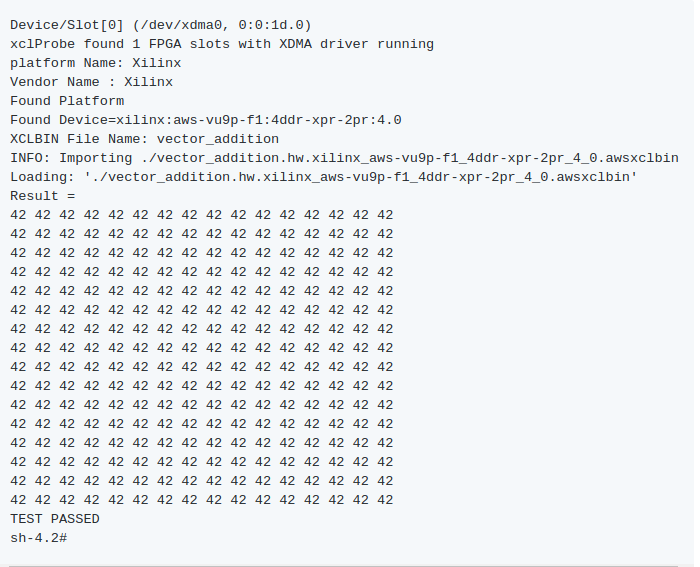

DETI/UFC - Cursos de Eng. de Computação e Eng. de Telecomunicações

Elaborada por Jardel Silveira e Vanessa Rodrigues

# ** Executando um exemplo Hello World SDAccel na AWS F1**

**Descrição**

Nesta prática vamos executar o exemplo Hello World disponível no [repositório de exemplo SDAccel](https://github.com/Xilinx/SDAccel_Examples), que contém uma coleção de exemplos voltados para o ensino das melhores práticas do usuário sobre como usar diferentes recursos do SDAccel. A execução será realizada configurando o ambiente do SDAccel na instância f1 e gerando os arquivos Host application,

AWS FPGA binary, Amazon FPGA Image (AFI) necessários para a sintetização do projeto. O arquivo binário, AWS FPGA binary, será lido pelo Host application para determinar a AFI que deve ser carregada na FPGA.

**Objetivos de Aprendizagem** 

**Parte 1: Criação de uma instância EC2 F1 a partir do AWS console.**

1. Inicie e conecte-se a uma instância EC2 f1.2xlarge, seguindo os procedimentos descritos nas partes 1 e 2 da [prática Criação de uma Amazon FPGA Image (AFI) do exemplo CL hello_world](https://docs.google.com/document/d/1VEQpTWpr_yJ7DyCrB39Ty3BV7BZVK340KL0lC4bFKfM/edit), alterando apenas o nome da região para  **us-west-2** no item 2 da parte 1.


**Parte 2: ****Configurando a instância para trabalhar com SDAccel**

1. Configure o AWS CLI inserindo as mesmas credenciais (AWS Access Key Id e AWS Secret Access key) utilizadas na Parte 1

	**aws configure
	AWS Access Key ID [None]: 
	AWS Secret Access Key [None]: 
	Default region name [None]: **<use a região us-west-2>
**	Default output format [None]:** json

2. Clone** **o repositório que contém os arquivos necessários para executar o SDAccel e , em seguida, compile e instale os drivers necessários. Para isso, execute o seguintes comandos

git clone https://github.com/aws/aws-fpga.git $AWS_FPGA_REPO_DIR  
cd $AWS_FPGA_REPO_DIR                                         
source sdaccel_setup.sh

**Parte 3:  Executando o exemplo Hello World do SDAccel na AWS F1**

1.   Execute os seguintes comandos para configurar o ambiente SDAccel

cd $AWS_FPGA_REPO_DIR  
source sdaccel_setup.sh
source $XILINX_SDX/settings64.sh

2. Gere e execute Os fluxos de emulação SDAccel, que permitem o teste e debug, por exemplo, da aplicação antes da implantação na F1. 

Para isso, execute o fluxo de emulação SW para o exemplo hello world SDAccel

	cd $SDACCEL_DIR/examples/xilinx/getting_started/host/helloworld_ocl/
	make clean
	make check TARGETS=sw_emu DEVICES=$AWS_PLATFORM all

	

	Em seguida, execute o fluxo de emulação HW para o exemplo hello world SDAccel

	cd $SDACCEL_DIR/examples/xilinx/getting_started/host/helloworld_ocl/
	make clean
	make check TARGETS=hw_emu DEVICES=$AWS_PLATFORM all

3. Os seguintes arquivos devem ser gerados para executar na instância f1:

    1. Host application

    2. AWS FPGA binary

    3. Amazon FPGA Image (AFI)

	Gerar esses arquivos é um processo de duas etapas. Na primeira etapa o SDAccel é usado para gerar o Host application e o Xilinx FPGA binary. Na segunda etapa o script create_sdaccel_afi.sh é usado para criar a AFI e o arquivo AWS FPGA binary a partir do  Xilinx FPGA binary.

	Antes  da realização desse processo é necessário criar um bucket com uma pasta para guardar um DCP que será gerado e uma pasta de log para guardar o arquivo de log. Para isso, execute os comandos abaixo:

$ aws s3 mb s3://<bucket-name> --region <region>   # Criar um S3 bucket (Escolha um nome único para o bucket)
	$ aws s3 mb s3://<bucket-name>/<dcp-folder-name>/   # Criar uma pasta para o DCP

aws s3 mb s3://<bucket-name>/<logs-folder-name>/ # Criar uma pasta para guardar seu arquivo de log

* Geração  do host application e do *.xclbin (Xillinx FPGA binary file)

cd $SDACCEL_DIR/examples/xilinx/getting_started/host/helloworld_ocl/
	make clean
	make TARGETS=hw DEVICES=$AWS_PLATFORM all

* Criação do AWS FPGA binary e AFI a partir do *.xclbin (Xilinx FPGA binary file)

		cd xclbin
		$SDACCEL_DIR/tools/create_sdaccel_afi.sh \
		-xclbin=vector_addition.hw.xilinx_aws-vu9p-f1_4ddr-xpr-2pr_4_0.xclbin \
		-s3_bucket=<bucket-name> \
		-s3_dcp_key=<dcp-folder-name> \
		-s3_logs_key=<logs-folder-name>

O script create_sdaccel_afi.sh faz o seguinte:

* Inicia um processo em segundo plano para criar a AFI

* Gera um arquivo  _afi_id.txt que contém a FPGA Image Identifier (ou AFI ID) e o FPGA Global Image Identifier (ou AGFI ID) da AFI gerado

* Cria o arquivo AWS FPGA binary *.shclbin que precisará ser lido pelo Host application para determinar qual AFI deve ser carregada na FPGA.

4. O processo de criação do AFI iniciado em background não é instantâneo. É preciso garantir que o processo seja concluído com sucesso antes de poder ser executado na instância F1. 

5. Observe os valores das IDs AFI abrindo o arquivo _afi_id.txt

	cat *afi_id.txt

6. Use a describe-fpga-images API para verificar o status do processo de geração da AFI

aws ec2 describe-fpga-images --fpga-image-ids <AFI ID>

Quando a criação do AFI for concluída com sucesso, a saída deve conter:

...
	"State": {
  	  "Code": "available"
	 },
	...

Aguarde até que o AFI fique disponível antes de continuar a executar a aplicação na instância F1.

7. Execute o Host Application utilizando o seguinte comando

	cd ..

sudo sh

source /opt/Xilinx/SDx/2017.1.rte.4ddr/setup.sh   

./helloworld 

8. O exemplo de aplicação exibirá as seguintes mensagens: 

	

**Parte 4: Fechando a Sessão**

Depois de terminar sua sessão, você pode "Parar" ou "Terminar" sua instância. Se você 'Terminar' a instância, seu volume raiz será excluído. Você precisará criar e configurar uma nova instância na próxima vez que precisar trabalhar na F1. Se você parar a instância, o volume do root é preservado e a instância interrompida pode ser reiniciada mais tarde, não precisando mais passar por etapas de configuração. A AWS não cobra por instâncias interrompidas, mas pode cobrar por qualquer volume EBS anexado à instância.

* Feche a sessão remota (exit)

* Retorne para o EC2 Dashboard: [https://console.aws.amazon.com/ec2](https://console.aws.amazon.com/ec2)

* Selecione **Instances **no menu lateral esquerdo.

* Selecione a Instância que está sendo executada, clique **Actions**, escolha **Instance State** e em seguida, clique em **Terminate**.

* Selecione **Elastic Block Store **no menu lateral esquerdo e clique em **Volumes**.

* Selecione os volumes listados na tela, clique em **Actions**, e em seguida, clique em **Delete Volumes**.

	

	

**Referências**

* Amazon Web Services. Hardware Development Kit (HDK) e Software Development Kit (SDK) [internet]. [Acesso em: 26 dez. 2017]. Disponível em: https://github.com/aws/aws-fpga/blob/master/hdk/docs/IPI_GUI_Vivado_Setup.md

* XILINX. **Create, configure and test an AWS F1 instance. **2017. Disponível em: <https://github.com/Xilinx/SDAccel_Examples/wiki/Create,-configure-and-test-an-AWS-F1-instance>. Acesso em: 16 mar. 2018.

